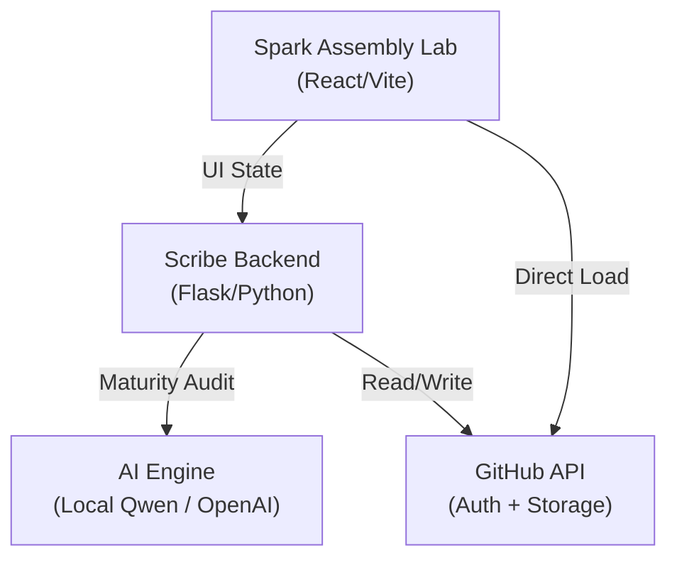

# 📜 TheCommons: Master Framework (v3.0)

### *For the Architects of the Open Build.*

Every day, a world-changing idea dies in a basement because its creator lacked a platform, a connection, or a seat at the table. History is littered with the names we *don't* know — the innovators who were sidelined because they had the insight but lacked the framework to validate it.

**TheCommons** is a tribute to them. 

We are building a **Modular Idea Meritocracy** — a "LEGO set" for human progress. We believe that ideas shouldn't be locked in vaults; they should be designed as interoperable, falsifiable sparks that anyone can refine. We honor the inventor by providing the baseplate for their vision to become documented, modelled, and implemented reality.

---

## 🏛️ Governance & Philosophy: The Spark Maturity Model

The Commons is governed by a meritocratic hierarchy where influence (Contribution Score) is earned by advancing ideas through defined maturity stages. Every contribution needs **"Clutch Power"** to stick: evidence, logic, and falsifiability.

### [👉 Read the Unified Manifesto & Guide v3.0](docs/MANIFESTO.md)

**The Core Pillars:**
*   **💡 The Spark:** The atomic unit of value. A structured markdown file following the [8-section standard](templates/enhanced_spark.md).
*   **📈 Maturity Lifecycle:** Ideas evolve from `seed` → `structured` → `modeled` → `validated` → `implemented`.
*   **🛠️ Execution is the Moat:** We reward the "rigor" — the modeling, experimental results, and code that makes an idea solid.
*   **🔗 Interoperability:** Everything is designed to be snapped onto. No closed silos.
*   **📡 Host-Agnostic:** Data belongs to the community. Transition-ready via the Scribe v2.0 protocol.

---

## 🚀 Getting Started (The Instruction Manual)

New to the Commons? Here is how you earn your seat at the table by advancing the maturity of a Spark:

1.  **Level 1: Open (+5 CS):** Create a new Spark. Fill in the **Narrative** and **Hypothesis** (Sections 1 & 2). Set maturity to `seed`.
2.  **Level 2: Advance (+10–15 CS):** Take an existing spark and add **Modeling** or **Evaluation** strategies (Sections 3 & 4).
3.  **Level 3: Validate (+25–35 CS):** Run the simulation or experiment. Populate **Results** (Section 6) and reach `validated` or `implemented` status.

> **⚖️ Reputation Shield:** Contribution Score (CS) decays at **10% per month** for Scout-only (Narrative) contributions. To maintain influence, you must advance ideas into Design and Validation tiers.

### Visual Tour & Demo

Try the **[Live Demo](https://spark-assembly-lab-bgbmwuia5q-uc.a.run.app/)** to see the **Spark Assembly Lab** in action. Build Sparks using the new 8-section maturity-aware interface.

👉 **[Launch Spark Assembly Lab](https://spark-assembly-lab-bgbmwuia5q-uc.a.run.app/)**

**Key Features:**
- **Two-Column Split View:** Fixed narrative on the left, swappable research modules on the right.
- **8-Section Standard:** Full support for the Enhanced Spark template.
- **Global Spark Search:** Find `.spark.md` files across all of GitHub with advanced filters.
- **AI Scribe (Glass Box):** Get local-first feedback (Qwen2.5) on your spark's maturity and falsifiability.
- **Stability Indicator:** Real-time completion tracking (e.g., 2/8 Sections Stable).

---

## 🤖 AI Scribe v2.0 (The Glass Box)

The Commons is assisted by an AI Scribe that ensures every new brick follows the standard gauge of the community.

*   **Local-First:** Runs on your CPU/GPU using `llama-cpp-python` or falls back to Groq.
*   **Reasoning Logs:** See exactly why the Scribe accepted or challenged a maturity shift.
*   **Maturity Audit:** Validates Sect. 2 (Hypothesis) for falsifiability before allowing a `structured` merge.

---

## 🏗️ System Architecture

---

> *"The Commons rewards the intuition to see the gap, the design to shape it, and the logic to make it stick — and the discipline to validate it."*