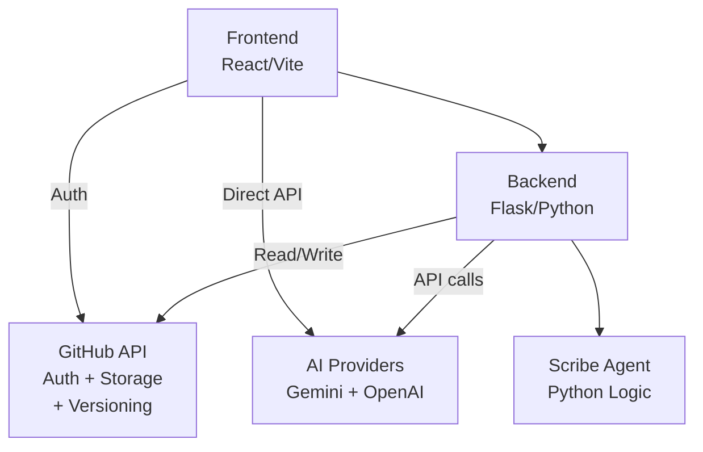

# 📜 TheCommons: Master Framework (v2.0)

### *For the Architects of the Open Build.*

Every day, a world-changing idea dies in a basement because its creator lacked a platform, a connection, or a seat at the table. History is littered with the names we *don't* know—the innovators who were sidelined because they had the **Spark** but lacked the **Logic** to build it, or the **Logic** but no room for **Design**.

**TheCommons** is a tribute to them. 

We are building a **Modular Meritocracy**—a "LEGO set" for human progress. We believe that ideas shouldn't be locked in vaults; they should be designed as interoperable bricks that anyone can snap into. We honor the silent inventor by providing the baseplate for their vision to become reality.

---

## 🏛️ Governance & Philosophy: The LEGO Trinity

The Commons is governed by a meritocratic hierarchy where influence is earned through three types of contribution. Like a LEGO brick, every contribution needs "Clutch Power" to stick.

### [👉 Read the Unified Manifesto & Guide v2.0](docs/MANIFESTO.md)

**The Core Pillars:**
* **🧠 Spark (The Scout):** We reward the "gut feel"—the ability to spot a gap in the ecosystem before others do.
* **🎨 Design (The Designer):** We reward the "leap"—the ability to design a **Novel Core** that solves the gap.
* **🛠️ Logic (The Builder):** We reward the "rigor"—the execution, code, and stress-testing that makes the idea solid.
* **🔗 Interoperability:** Execution is the only moat. We build things that are meant to be snapped onto, not hidden away.
* **📡 Host-Agnostic:** The data belongs to the community. If this host fails, the community is pre-authorized to migrate to the most active fork.

---

## 🚀 Getting Started (The Instruction Manual)

New to the Commons? Here is how you earn your seat at the table by adding mass to the build:

1.  **Phase 1: Scout (+5 CS):** Use your **Spark**. Find a "loose stud" (a bug, typo, or missing feature) and log it using `!HUNCH`.
2.  **Phase 2: Designer (+15 CS):** Use your **Design**. Take a hunch and give it a shape. Define the **Novel Core** using the `!SHAPE` template.
3.  **Phase 3: Builder (+25 CS):** Use your **Logic**. Write the code or technical specs to turn a design into a functional brick using `!BUILD`.

### Visual Tour & Demo

Try the **[Live Demo](https://spark-assembly-lab-bgbmwuia5q-uc.a.run.app/)** to see the [Spark Assembly Lab](spark-assembly-lab/README.md) in action. Build Sparks using the LEGO-style three-phase interface: 🧠 Spark, 🎨 Design, 🛠️ Logic.

👉 **[Launch Spark Assembly Lab](https://spark-assembly-lab-bgbmwuia5q-uc.a.run.app/)** *(Work in Progress)*

---

## 🤖 AI Scribe Commands (The Standard Gauge)

The Commons is assisted by an AI Scribe that ensures every new brick follows the standard gauge of the community.

* **`!HUNCH`**: Logs a spark or observation of a gap.
* **`!SHAPE`**: Validates a blueprint and checks for "Prior Art" (Novelty Audit).
* **`!BUILD`**: Runs a stability check to ensure your logic doesn't break existing bricks.
* **`!VOTE_VETO`**: A community safety-valve to halt structural changes.

---

## 🏗️ System Architecture

TheCommons is built on a modular architecture where:
- **Frontend** (React/Vite) provides the LEGO-style assembly interface
- **Backend** (Flask/Python) orchestrates operations and provides API proxies
- **GitHub** serves as the single source of truth for auth, storage, and version control
- **AI Providers** (Gemini, OpenAI) power the reflection-based Quiz feature
- **Scribe Agent** (Python) validates Sparks and evaluates submissions

---

> *"The Commons rewards the spark to see the gap, the design to design the piece, and the logic to make it stick."*