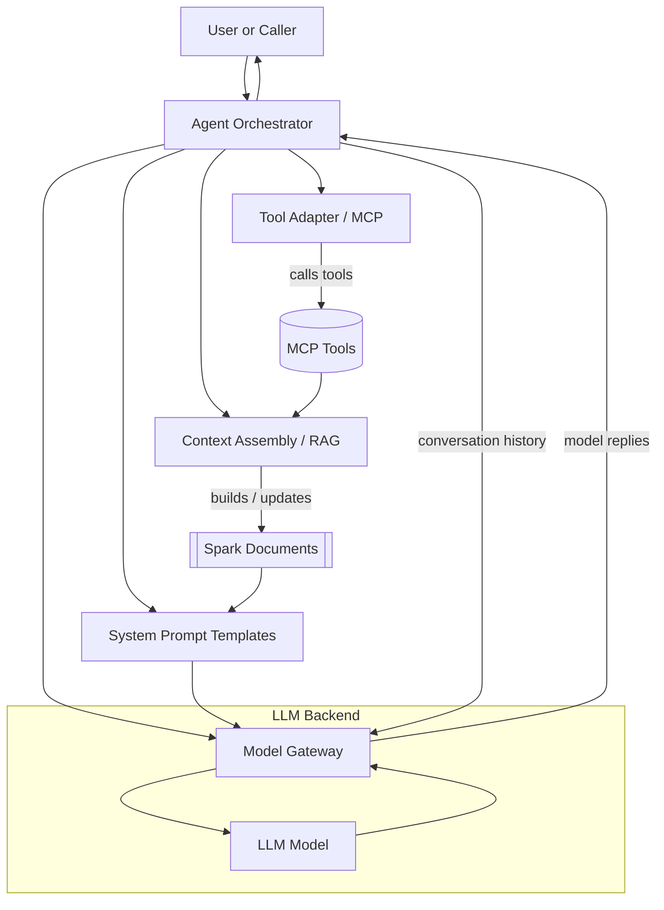
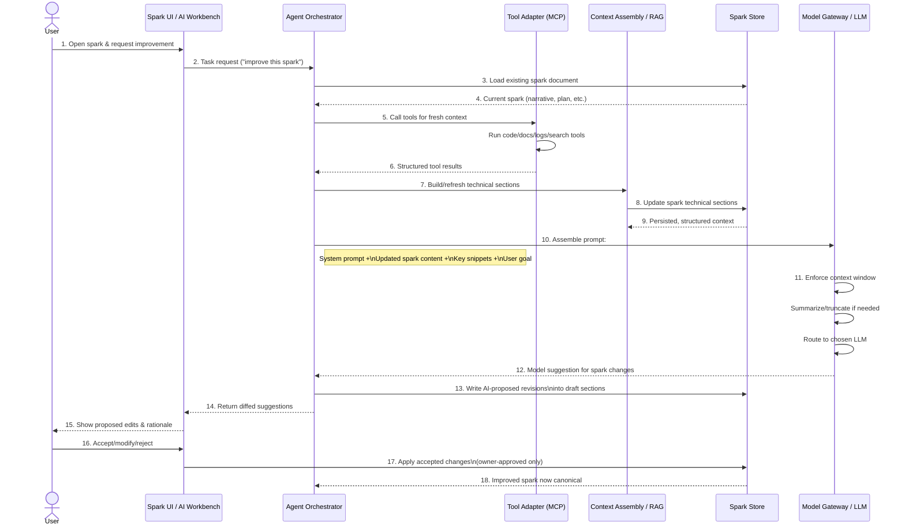

# Context Engineering System Design

This document describes a context‑engineering architecture built from the following constructs:

- **LLM Model**
- **Context Window** (filled primarily by structured "Spark" documents)
- **RAG (Spark)**
- **Tools (MCP)**
- **Agents (tasks)**
- **System Prompt (base instructions)**

The goal is to make context a first‑class, engineered artifact rather than an ad‑hoc prompt string.

---

## 1. High‑Level Architecture

The system is organized around an **Agent Orchestrator** that coordinates tools, retrieval, spark documents, and LLM calls.

Key ideas:

- **Sparks** are the primary *context artifact*.
- The **Model Gateway** enforces the **context window** constraint and decides how much of each spark, retrieval snippet, and chat history to send.
- The **Agent Orchestrator** is the front door: it may be called by a human, another service, or a scheduled job.

---

## 2. Core Constructs

### 2.1 LLM Model

- One or more LLMs (e.g., Codex / Claude Code, or other backends) made available through a **Model Gateway**.
- Different models can be selected per task (e.g., fast model for drafting, stronger model for evaluation).

### 2.2 Context Window

- The maximum number of tokens the model can accept per call.
- The **Model Gateway**:
  - Tokenizes the assembled prompt (system prompt + spark content + retrieved snippets + conversation).
  - If too large, triggers summarization/truncation strategies (e.g., summarize long sections, drop low‑priority snippets).
- Practically, the *spark* is the main occupant of this window, with extra capacity for recent conversation and retrieved context.

### 2.3 RAG (Spark)

- A **Context Assembly / RAG Service** is responsible for building and updating *Spark* documents:
  - Pulls from tools (code search, logs, APIs, documents).
  - Uses embeddings and heuristics to find relevant materials.
  - Writes them into a structured spark schema (narrative, hypotheses, constraints, evaluation plan, etc.).
- RAG here is not just "retrieve and paste"; it **curates** content into a reusable, human‑readable spark.

### 2.4 Tools (MCP)

- A **Tool Adapter** speaks MCP and exposes tools as callable functions to agents.
- Examples:
  - Code search, repo navigation.
  - Querying internal metrics or logs.
  - Fetching external documentation or tickets.
- Tools **produce raw data**; RAG consumes this data and folds it into sparks.

### 2.5 Agents (Tasks)

- The **Agent Orchestrator** runs "agents" that represent task strategies (e.g., "review PR", "design experiment", "debug incident").
- For each task, an agent:
  - Chooses the right **system prompt template**.
  - Decides which tools to call, and with what arguments.
  - Invokes the RAG service to refresh/update sparks.
  - Calls the Model Gateway and interprets results.
- Agents can run in three modes:
  - **Interactive**: a human provides input and receives replies.
  - **Programmatic**: another service calls the orchestrator via API.
  - **Background/triggered**: events (new PR, anomaly, etc.) kick off runs automatically.

### 2.6 System Prompt (Base Instructions)

- A **Prompt Template Layer** defines system prompts per agent/task type:
  - Role (e.g., "PR reviewer", "research planner").
  - Output contract (e.g., JSON schema, markdown structure).
  - Constraints (e.g., safety, style, length).
- Templates are **versioned and parameterized**:
  - Slots for spark metadata (title, domain, maturity).
  - Slots for sections (narrative, hypothesis, constraints).
  - Slots for task‑specific instructions (e.g., "focus on API changes").

---

## 3. Components and Responsibilities

### 3.1 Agent Orchestrator

- Entry point for all tasks.
- Responsibilities:
  - Accepts a task request (interactive or programmatic).
  - Selects:
    - Agent profile (what tools and flows are allowed).
    - System prompt template.
    - Target model (via the Model Gateway).
  - Runs a loop:
    1. Call tools via MCP (if needed).
    2. Ask RAG to update the relevant spark(s).
    3. Assemble prompt and call the LLM.
    4. Interpret the result (possibly updating sparks again).

### 3.2 Tool Adapter (MCP Client)

- Uniform interface to all MCP tools.
- Handles:
  - Registry of tools and their input/output shapes.
  - Authentication, routing, error handling.
- Returns structured results that the RAG service and agents can consume.

### 3.3 Context Assembly / RAG Service

- Given a task and recent tool outputs:
  - Retrieves additional relevant artifacts (via embeddings or indices).
  - Summarizes and normalizes them.
  - Writes or updates **Spark documents** with structured sections.
- RAG output is typically stored in one or more **technical sections inside the spark** (for example, "Retrieved Context", "Evidence Summary", or "Source Index").
  - These sections are primarily maintained by agents and pipelines.
  - Humans can still read, annotate, or override them when needed.
- Can maintain:
  - One spark per task.
  - Or multiple sparks per task (e.g., "Problem Spark", "Experiment Spark", "Incident Spark").

### 3.4 Spark Documents

- Long‑lived, human‑readable context artifacts.
- Typically include:
  - Narrative / problem description.
  - Hypothesis formalization.
  - Modeling or experimentation plan.
  - Constraints, assumptions, metrics.
  - Results, revision notes, community proposals.
  - One or more **agent‑managed technical sections** that hold the outputs of RAG (retrieved snippets, evidence summaries, indices).
- Designed to be:
  - **Readable by humans** (markdown/YAML).
  - **Consumable by models** (as structured context).
  - In this implementation, stored canonically as versioned files in GitHub repositories; no separate database is used as the source of truth for sparks.

### 3.5 Model Gateway & LLM Backend

- Abstracts away vendor specifics (Codex, Claude Code, and future providers).
- Enforces the **context window**:
  - Token accounting for system prompt, spark(s), retrieved snippets, and conversation.
  - Configurable strategies for truncation and summarization.
- Routes calls to the selected **LLM Model** and returns normalized responses.

---

## 4. Request Lifecycle

A typical interactive request flows as follows:

1. **Task received**  
   The caller provides: task type, user question/goal, and any initial context.

2. **Agent selection & prompt template**  
   Orchestrator chooses the appropriate agent and system prompt template.

3. **Tool and RAG phase**  
   Agent calls MCP tools (code search, logs, docs, etc.).  
   RAG service aggregates results and (re)builds spark documents.

4. **Prompt assembly**  
   Prompt Layer combines:
   - System prompt (from template).
   - Spark content (possibly truncated or summarized).
   - Most recent conversation turns.
   - Important retrieved snippets that did not fit into the spark yet.

5. **Context window enforcement & model call**  
   Model Gateway ensures the assembled prompt fits the model's context window.  
   Executes the LLM call and returns the response.

6. **Result handling**  
   Agent interprets the output:
   - Updates sparks (e.g., new hypotheses, revised plan).
   - Generates a reply for the caller (human or service).
   Optionally logs the full trace for evaluation.

### 4.1 Sequence Diagram: Improving a Spark with Context Engineering

---

## 5. Interaction Modes

- **Human‑in‑the‑loop**  
  A person chats with an agent, sees spark updates, and can edit sparks manually.

- **Service‑driven**  
  Another system makes API calls into the orchestrator to, for example, auto‑generate experiment designs or incident reports.

- **Event‑driven / batch**  
  Periodic or event‑based tasks (new PR, anomaly, deployment) trigger agents that update sparks and post results (e.g., to chat, dashboards, or PR comments).

In all cases, **sparks remain the core artifact** that bridges raw data, LLM output, and human understanding.

---

## 6. Collaboration Model

In this model, non-owner collaboration is intentionally funneled through a single, structured surface:

- **Feedback & Critique as the main entry point**  
  Non-owners do not directly edit core spark sections. Instead, they append feedback and critique into the dedicated "Feedback & Critique" section of the spark. This keeps all collaborative signal inside the spark while preserving owner control over the canonical narrative and plan.

- **Proposals as GitHub Issues**  
  When a non-owner wants to move from raw feedback to a concrete change proposal, the UI exposes a "Propose" action that creates a GitHub issue linked to the spark file. The issue contains:
  - A short summary of the proposed change.
  - References to the relevant spark sections.
  - Any supporting feedback/critique they’ve already added.

- **Owners as curators**  
  Spark owners (or maintainers) remain the only ones who edit core sections directly or submit PRs that change the spark file. They treat issues + feedback as inputs, then update the spark and sync changes back to the repo.

This keeps the spark as the single context artifact, with feedback and proposals layered on top through GitHub issues and PRs.

---

## 7. Relation to This Repository

In the spark-assembly-lab project, you can see concrete examples of these concepts:

- Spark documents and templates (YAML + markdown).
- An "AI Workbench" that takes a spark and uses the configured LLM (Codex or Claude Code) to propose updates.
- A UI and workflow that let humans inspect and apply AI‑generated spark revisions.

Those existing pieces can be evolved into a generic implementation of the architecture described here.
