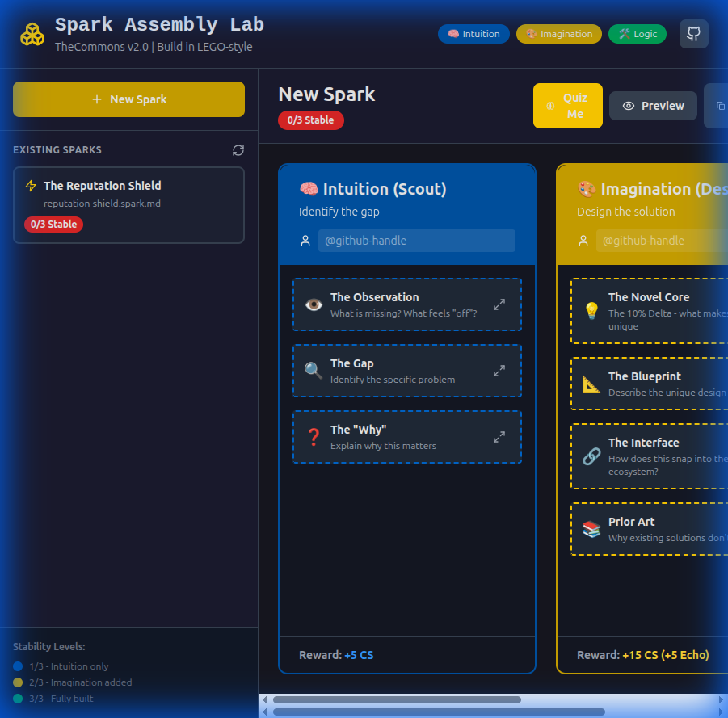
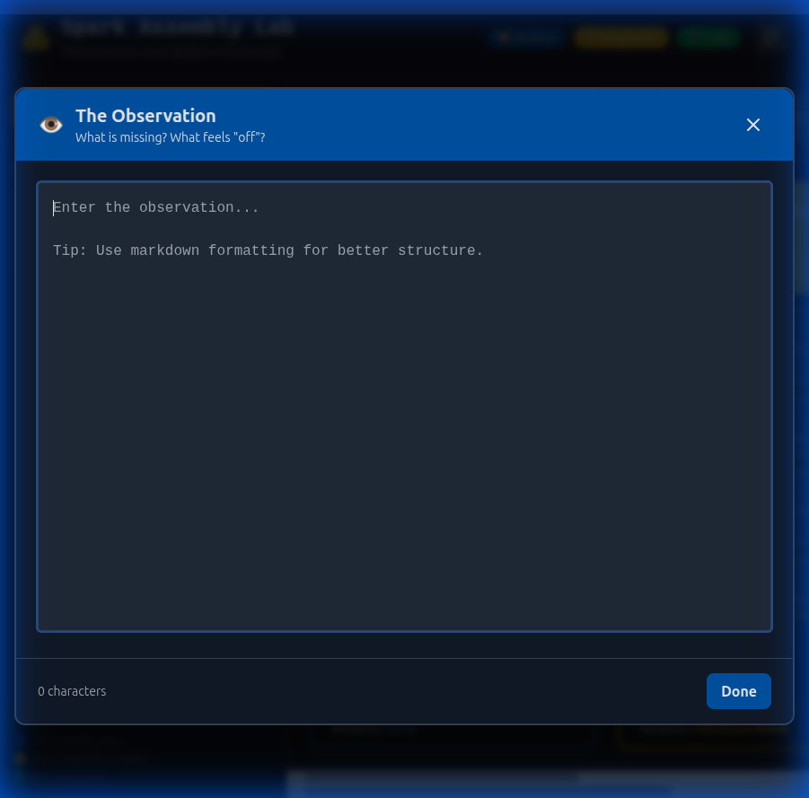
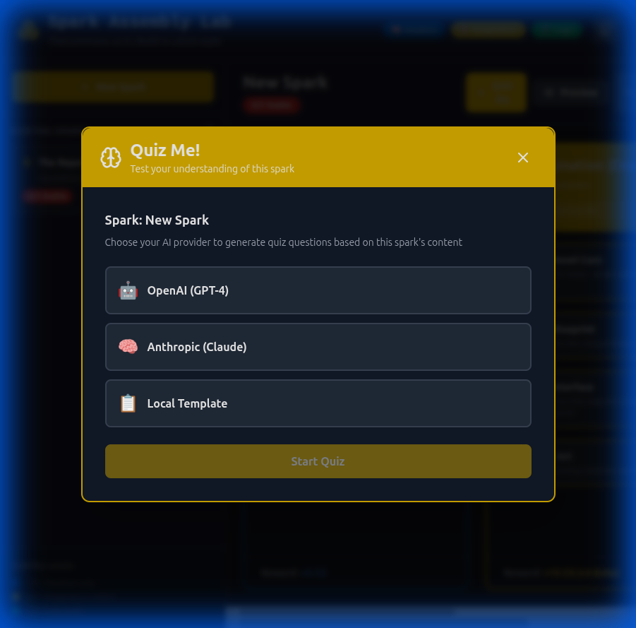
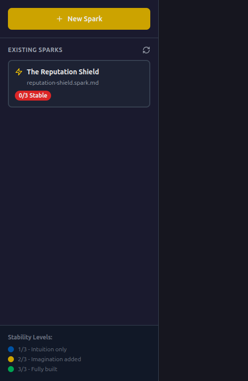

# Spark Assembly Lab

A React-based LEGO-style interface for building and visualizing **Sparks** in TheCommons v2.0 modular meritocracy.

## 📸 Screenshots

### Main Assembly Interface

*The three-phase LEGO-style interface: Intuition (Blue), Design (Yellow), and Logic (Green)*

### Building Blocks in Action

*Expandable building blocks with phase-specific colors and icons*

### Full-Screen Editor

*Click the maximize icon to expand any block to full-screen for focused editing*

### Quiz Me Feature

*Interactive quiz system to test understanding of spark content*

### Spark Selector & Preview

*Sidebar showing existing sparks with stability indicators and live markdown preview*

## 🎯 Features

- **GitHub Authentication**: Login with your GitHub account using Personal Access Token (PAT)
- **Visual Assembly**: Build sparks using a 3-lane LEGO-style interface (Intuition, Design, Logic)
- **Building Blocks**: Modular components for each phase with expandable form fields
- **Full-Screen Editor**: Maximize any block for focused, distraction-free editing
- **Quiz Me**: Interactive AI-powered quiz system to test understanding of spark content
- **External Repo Loading**: Load sparks from any GitHub repository dynamically
- **Mobile Responsive**: Fully optimized for mobile devices with drawer navigation
- **Live Preview**: Real-time markdown preview of your spark
- **Stability Tracking**: Visual indicators showing completion status (0/3 to 3/3 Stable)
- **Smart Loading**: Automatically loads existing sparks from the `/sparks/` directory or external repos
- **Export**: Download sparks as properly formatted markdown files
- **Toast Notifications**: User-friendly feedback for actions
- **Theme**: Blueprint-inspired design with phase-specific colors (Blue, Yellow, Green)

## 🏗️ The Three Phases

### 🧠 Intuition (Scout) - Blue (#0066cc)
Identify the gap in the ecosystem
- **The Observation**: What is missing?
- **The Gap**: Identify the specific problem
- **The "Why"**: Explain why this matters
- **Reward**: +5 CS

### 🎨 Design (Designer) - Yellow (#ffcc00)
Design the solution
- **The Novel Core**: The 10% Delta
- **The Blueprint**: Describe the unique design
- **The Interface**: How does this snap into the ecosystem?
- **Prior Art**: Why existing solutions don't work
- **Reward**: +15 CS (+5 Echo Bonus)

### 🛠️ Logic (Builder) - Green (#00cc66)
Build and test
- **Technical Implementation**: The actual code/logic
- **Clutch Power Test**: Verify compatibility
- **Dependencies**: Required sparks or libraries
- **Reward**: +25 CS (+10 Prototype Bonus)

## 🚀 Quick Start (Docker Only)

### Local Deployment (Docker Compose)

```bash
# From the spark-assembly-lab directory
docker compose up

# Or run in detached mode
docker compose up -d

# Visit http://localhost:3000
```

**Note:** Use `docker compose` (V2, no hyphen) instead of `docker-compose` (V1, deprecated).

The Docker setup automatically:
- Installs all dependencies
- Mounts the repo for live updates
- Enables hot module replacement (HMR)
- Runs the Flask API on port 8080

### Cloud Deployment (Cloud Run)

```bash
# From the repo root
docker build -f spark-assembly-lab/Dockerfile.prod -t spark-assembly-lab:prod .

# Run locally on port 8080
docker run -p 8080:8080 spark-assembly-lab:prod

# Deploy to Cloud Run (example)
gcloud run deploy spark-assembly-lab \
   --source . \
   --dockerfile spark-assembly-lab/Dockerfile.prod \
   --region us-central1 \
   --allow-unauthenticated
```

## 📁 Project Structure

```
spark-assembly-lab/
├── src/
│   ├── components/
│   │   ├── AssemblyCanvas.jsx      # Main workspace with 3 lanes
│   │   ├── PhaseLane.jsx           # Individual phase column
│   │   ├── BuildingBlock.jsx       # Expandable form component
│   │   ├── SparkSelector.jsx       # Sidebar for existing sparks
│   │   ├── MarkdownPreview.jsx     # Live markdown preview
│   │   ├── GitHubAuth.jsx          # GitHub authentication component
│   │   ├── Header.jsx              # App header with auth
│   │   └── Toast.jsx               # Toast notification
│   ├── utils/
│   │   ├── github.js               # GitHub API utilities
│   │   ├── sparkParser.js          # Markdown parsing & generation
│   │   └── ToastContext.jsx        # Toast notification provider
│   ├── types/
│   │   └── spark.js                # Type definitions & metadata
│   ├── App.jsx                     # Main application
│   ├── main.jsx                    # Entry point
│   └── index.css                   # Global styles
├── public/
│   └── sparks/                     # Mounted from parent /sparks/
├── Dockerfile
├── docker-compose.yml
└── package.json
```

## 🎨 Design System

### Colors
- **Intuition Blue**: `#0066cc` - Represents discovery and observation
- **Design Yellow**: `#ffcc00` - Represents creativity and design
- **Logic Green**: `#00cc66` - Represents execution and building
- **Commons Dark**: `#1a1a2e` - Main background
- **Commons Darker**: `#16161f` - Deeper background

### Typography
- **Headers**: Bold, sans-serif (Inter)
- **Code**: Monospace (JetBrains Mono)
- **Body**: Sans-serif (Inter)

## 🔧 Technical Stack

- **Framework**: React 18
- **Build Tool**: Vite 5
- **Styling**: Tailwind CSS 3
- **Markdown**: react-markdown + gray-matter
- **Drag & Drop**: react-dnd (prepared for future enhancements)
- **Icons**: lucide-react
- **Authentication**: GitHub Personal Access Token (PAT)
- **API**: GitHub REST API v3
- **Containerization**: Docker

## 📖 Usage Guide

### GitHub Authentication

The app uses a simple Personal Access Token (PAT) authentication system:

1. Click the **Login** button in the header (top-right)
2. A token input field will appear
3. Get your token using one of these methods:
   - **CLI Method**: Run `gh auth token` in your terminal (requires GitHub CLI)
   - **Web Method**: Click "Create new token" to open GitHub Settings and generate a new token
4. Paste your token into the input field and click **Login**
5. Your profile will appear in the header showing your avatar and username
6. Click **Logout** (arrow icon) to sign out

**Note:** Your token is stored locally in your browser and never sent to any server except GitHub's API for validation.

### Creating a New Spark

1. Click **"New Spark"** in the sidebar
2. Enter a name for your spark
3. Fill in the building blocks for each phase:
   - Click on a block to expand it
   - Enter your content in the text area
   - Click outside or on another block to collapse
4. Click **"Preview"** to see the markdown output
5. Click **"Download"** to save as a `.spark.md` file
6. Or click **"Copy MD"** to copy to clipboard

### Loading Existing Sparks

1. **Enter Repository URL**: 
   - Enter a GitHub repository URL in the "Git Repository" input at the top of the sidebar
   - Supported formats:
     - `https://github.com/owner/repo`
     - `github.com/owner/repo`
     - `owner/repo`
   - Click the search icon or press Enter to load sparks from that repository
   - The app will search for all `.spark.md` files in the repository
   - Your choice is saved in localStorage and persists across sessions
2. Click on any spark in the sidebar to load it
3. The stability indicator shows completion level
4. Click **"Refresh"** icon to reload sparks from the current source

### Server Configuration (Optional)

The server supports environment variables for configuration:

```bash
# GitHub authentication (optional)
GITHUB_TOKEN=your_token_here      # For private repos or higher rate limits

# Cache settings
SPARK_CACHE_TTL_SECONDS=60        # Cache duration (default: 60 seconds)
```

The application does not have a default repository - users must specify a repository URL to load sparks.

### Stability Levels

- **0/3 Stable** (Red): No phases completed
- **1/3 Stable** (Blue): Intuition phase filled
- **2/3 Stable** (Yellow): Intuition + Design filled
- **3/3 Stable** (Green): All phases completed

## 🐳 Docker Configuration

The `docker-compose.yml` mounts the parent `/sparks/` directory as read-only, allowing the UI to load actual spark files without modifying them directly. This ensures:

- Live updates when sparks are added/modified
- Safe read-only access to production sparks
- Easy development and testing

### Docker Commands

```bash
# Start containers
docker compose up

# Start in background
docker compose up -d

# Stop containers
docker compose down

# View logs
docker compose logs -f

# Rebuild and restart
docker compose up --build

# Stop and remove everything
docker compose down -v
```

## 🚧 Future Enhancements

- [ ] Drag-and-drop block reordering
- [ ] Collaborative editing with real-time sync
- [ ] GitHub integration for direct PR creation with authenticated user
- [ ] Spark comparison view
- [ ] Contribution history timeline
- [ ] CS point calculator
- [ ] Auto-save to local storage
- [ ] Dark/Light theme toggle
- [ ] Mobile responsive design
- [ ] Spark dependency graph visualization
- [ ] Integration with GitHub GraphQL API for advanced features

## 📝 Contributing

To add new building block types:

1. Add the block type to `src/types/spark.js` → `BlockTypes`
2. Add metadata to `BlockMetadata` with title, description, icon
3. Update `src/utils/sparkParser.js` to parse/generate the new block
4. The UI will automatically include it in the appropriate phase

## 📄 License

Part of TheCommons v2.0 - See parent repository for license details

---

> *"Build with LEGO-style clarity. Snap ideas together. Create what matters."*
